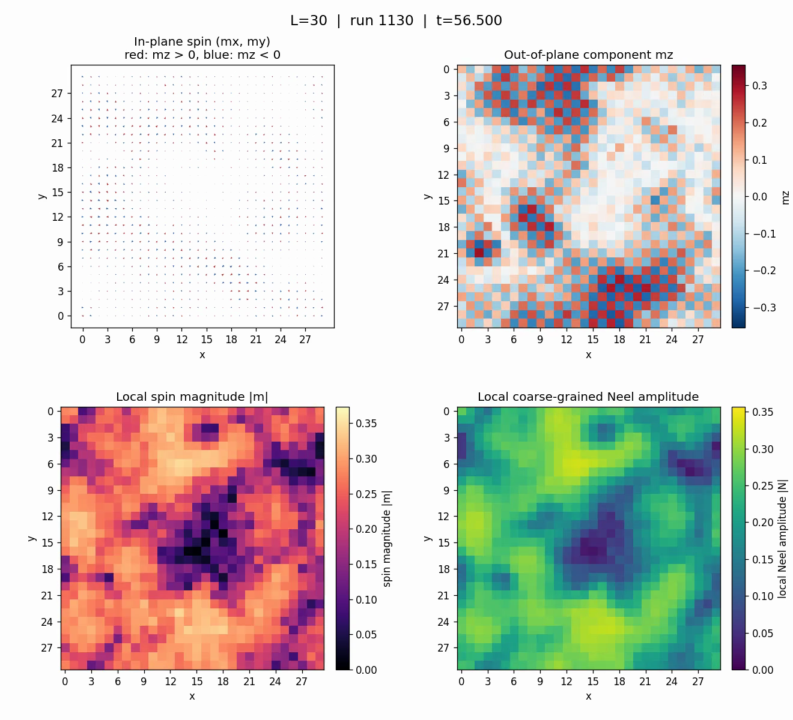

# CUDA implementation of the stochastic SDW evolution

This directory contains the two-dimensional spin-density-wave (SDW) evolution used for the example below. It complements [`../integrator/`](../integrator/): that directory isolates and verifies the numerical methods, whereas this directory couples the longitudinal-Heun/transverse-SIB scheme to the constrained electronic calculation.

## Example trajectory

[Download or play the 10 s MP4](results/neel30_four_panels.mp4).

[](results/neel30_four_panels.mp4)

The upper-left panel shows the in-plane components `(mx,my)` as arrows, with color indicating the sign of `mz`. The upper-right panel shows `mz`, the lower-left panel shows the local spin amplitude `|m|`, and the lower-right panel shows the local coarse-grained Néel amplitude. The movie is a visualization of one stochastic trajectory, not an ensemble average or a proof of equilibrium.

## Model and units

The electronic problem is the square-lattice, nearest-neighbor Hubbard SDW mean-field problem at fixed filling. We set

$$
\hbar=k_B=U=1,
$$

so energies and temperatures below are divided by $U$, while time is measured in $U^{-1}$. At each lattice site,

$$
\mathbf m_i=M_i\mathbf e_i,
\qquad M_i=|\mathbf m_i|,
\qquad |\mathbf e_i|=1.
$$

For a prescribed SDW texture, the code iterates the constraining field until the electronic expectation value agrees with that texture. The chemical potential is recomputed after every electronic diagonalization to maintain the requested filling. The converged thermodynamic field is then used in the stochastic dynamics.

The longitudinal and orientational equations implemented here are

$$
dM_i=\Gamma_\parallel\,\mathbf e_i\!\cdot\!\mathbf b_i\,dt
+\sqrt{2T_{\mathrm{fluc}}\Gamma_\parallel}\,dW_{i,\parallel},
$$

and

$$
d\mathbf e_i=
\left[\mathbf e_i\times\mathbf b_i
-\frac{\Gamma_\perp}{M_i}\,
 \mathbf e_i\times(\mathbf e_i\times\mathbf b_i)\right]dt
+\frac{\sqrt{2T_{\mathrm{fluc}}\Gamma_\perp}}{M_i}
 (I-\mathbf e_i\mathbf e_i^{\mathsf T})\circ d\mathbf W_i.
$$

The circle denotes the Stratonovich convention.

## Why transform the amplitude?

The physical spin amplitude is bounded by $0\leq M_i<1/2$. Directly evolving $M_i$ and clipping a step at $1/2$ changes the stochastic process and accumulates probability at the artificial clipping boundary. Instead, the code introduces an unconstrained coordinate $x_i$ through

$$
M_i=f(x_i)=\frac12\tanh x_i,
\qquad
x_i=\mathrm{atanh}(2M_i).
$$

This map enforces the upper bound geometrically: every finite $x_i$ gives $M_i<1/2$.

The transformation is especially simple in the Stratonovich convention because the ordinary chain rule remains valid. From

$$
dM_i=f'(x_i)\circ dx_i,
\qquad
f'(x_i)=\frac12\mathrm{sech}^2x_i,
$$

we obtain

$$
dx_i=\frac{dM_i}{f'(x_i)}=2\cosh^2x_i\,dM_i.
$$

Substitution of the longitudinal equation therefore gives the exact transformed SDE

$$
dx_i=
2\Gamma_\parallel\cosh^2x_i
(\mathbf e_i\!\cdot\!\mathbf b_i)dt
+\sqrt{8T_{\mathrm{fluc}}\Gamma_\parallel}
\cosh^2x_i\circ dW_{i,\parallel}.
$$

There is no extra Itô drift in this derivation: it is a Stratonovich change of variables. The price of removing the upper boundary is that both coefficients grow as $M_i\rightarrow1/2$, so trajectories very close to saturation require timestep refinement. The implementation also reflects $x_i$ at zero because $M_i=|\mathbf m_i|$ is a nonnegative amplitude.

## Longitudinal Heun and transverse SIB

For compactness, define

$$
A(x_i,\mathbf e_i,\mathbf b_i)
=2\Gamma_\parallel\cosh^2x_i(\mathbf e_i\cdot\mathbf b_i),
\qquad
G(x_i)=\sqrt{8T_{\mathrm{fluc}}\Gamma_\parallel}\cosh^2x_i.
$$

With $\Delta W_{i,\parallel}=\sqrt{h}\,\xi_i$ and one Gaussian draw $\xi_i$, the longitudinal predictor is

$$
\widetilde x_i=
\left|x_{i,n}+hA_{i,n}+G_{i,n}\Delta W_{i,\parallel}\right|.
$$

After evaluating the electronic field $\mathbf b_H$ at the jointly predicted spin texture, stochastic Heun gives

$$
x_{i,n+1}=\left|
x_{i,n}
+\frac{h}{2}(A_{i,n}+\widetilde A_i)
+\frac12(G_{i,n}+\widetilde G_i)\Delta W_{i,\parallel}
\right|,
$$

followed by $M_{i,n+1}=\tfrac12\tanh x_{i,n+1}$. The same Wiener increment appears in the predictor and corrector; drawing a second noise would define a different and incorrect method.

The orientation is advanced by the two-stage Semi-Implicit Scheme B (SIB). Each implicit midpoint rotation is solved by a Cayley map, which preserves $|\mathbf e_i|=1$ without post-step normalization. The transverse Wiener increment is likewise reused in both SIB stages.

One timestep uses three constrained electronic fields:

1. **Old field:** evaluate $\mathbf b_n=\mathbf b[M_n\mathbf e_n]$.
2. **Heun endpoint field:** jointly predict $(\widetilde x,\widetilde{\mathbf e})$, form $\widetilde{\mathbf m}=\frac12\tanh(\widetilde x)\widetilde{\mathbf e}$, and evaluate $\mathbf b_H=\mathbf b[\widetilde{\mathbf m}]$. This field corrects the longitudinal Heun step.
3. **SIB midpoint field:** form the old/predictor amplitude and orientation midpoint, evaluate $\mathbf b_S$ there, and use it in the second SIB rotation.

After accepting the new state, the field is evaluated there for the next timestep. This separates the Heun endpoint evaluation from the SIB midpoint evaluation instead of supplying both correctors with one shared approximate field.

The implementation treats $M=0$ as a reflecting boundary in the transformed coordinate. It aborts rather than silently clipping if an invalid amplitude, an excessively large transformed coordinate, a non-finite update, or a failed constrained electronic solve is encountered.

## Parameters of the displayed run

| Quantity | Value |
|---|---:|
| Lattice | $30\times30$, periodic |
| Sites | $N=900$ |
| Filling | $n=1$, represented by `fil = 0.5` of the $2N$ single-particle states |
| Hubbard scale | $U=1$ |
| Nearest-neighbor hopping | $t_{\mathrm{nn}}/U=0.25$ |
| Electronic smearing | $T_{\mathrm{elec}}/U=0.05$ |
| Fluctuation temperature | $T_{\mathrm{fluc}}/U=0.0005$ |
| Longitudinal mobility | $\Gamma_\parallel=0.1$ |
| Transverse mobility | $\Gamma_\perp=0.3$ |
| Timestep | $\Delta t\,U=0.05$ |
| Constrained-field mixing | `stp = 0.5` |
| Constrained-field tolerance | $10^{-5}$ for each vector component norm |
| Maximum constrained iterations | 5000 per field evaluation |
| Random-field initialization scale | $k/U=0.01$ |
| CUDA RNG seed | 2025 |

The preliminary Néel self-consistency calculation starts from `Delta = 0.05` and supplies the initial chemical potential. The evolved texture itself is then generated from independent random local constraining fields of scale `k = 0.01`; it is not initialized as a spatially homogeneous Néel texture.

## Files and execution

- [`sdw_evolution_cuda.jl`](sdw_evolution_cuda.jl): complete CUDA electronic solver and stochastic evolution.
- [`run_short.slurm`](run_short.slurm): 20-step GPU smoke test that writes snapshots at steps 10 and 20.
- [`results/neel30_four_panels.mp4`](results/neel30_four_panels.mp4): displayed trajectory.

Place the Julia and Slurm files in the same directory on the cluster and submit

```bash
sbatch run_short.slurm
```

The simulation accepts two environment variables:

```bash
export SDW_NRUNS=20
export SDW_OUTPUT_DIR=/path/to/output
julia sdw_evolution_cuda.jl
```

Without these variables, the code uses 10,000 steps and the default output path specified in the source. The Julia environment must provide `CUDA`, `DelimitedFiles`, `LinearAlgebra`, `Random`, and `Statistics`, and the job must run on an NVIDIA GPU supported by CUDA.jl.
