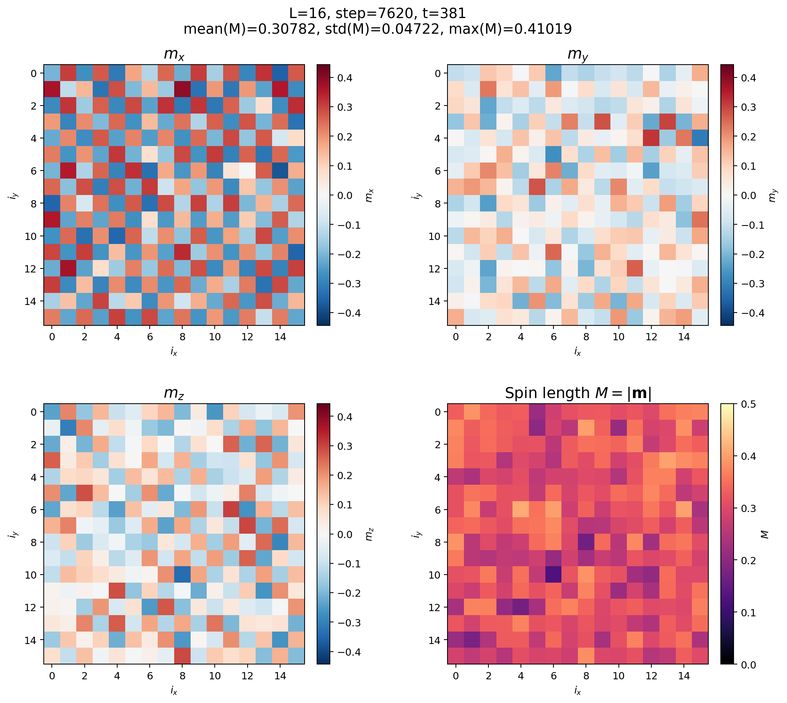
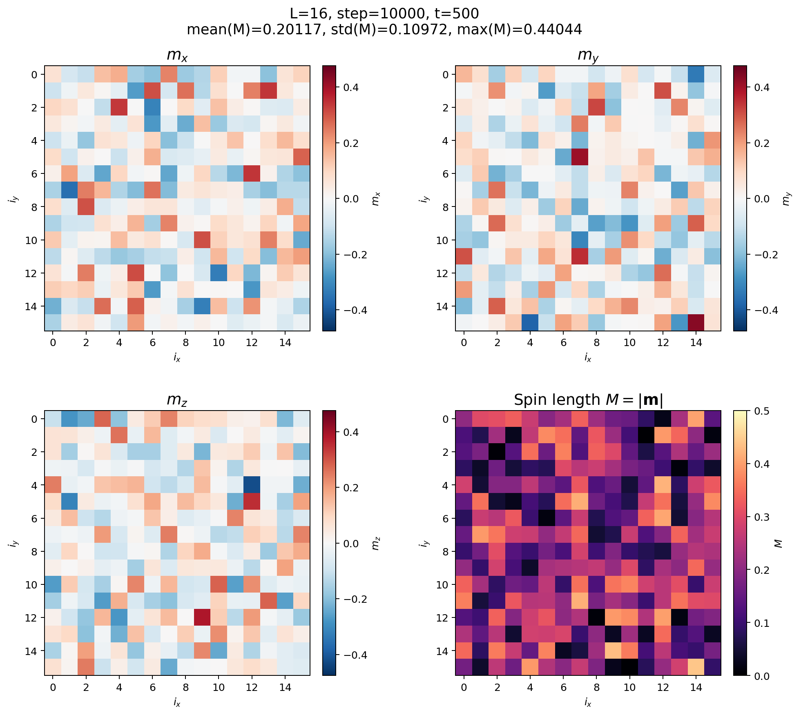

# Reflected-amplitude stochastic SDW dynamics

This directory records the current finite-temperature SDW experiment on a
$16\times16$ square lattice. It combines four ingredients:

1. direct stochastic evolution of the local amplitude
   $M_i=|\mathbf m_i|$ on its physical interval $0\le M_i\le1/2$;
2. a reflected stochastic-Heun predictor and corrector for $M_i$;
3. the original two-stage SIB/Cayley update for the direction
   $\mathbf e_i=\mathbf m_i/M_i$;
4. a local, site-resolved adaptive mixing coefficient $\alpha_i$ for the
   constrained electronic-field inversion.

The two examples below use the same temperature in the electronic
Fermi-Dirac distribution and in the stochastic bath. The $T=0.01$ snapshot
shows a clear checkerboard Néel pattern, primarily in $m_x$. The $T=0.03$
snapshot has no comparable system-wide alternating pattern and has a much
broader, lower-amplitude spin-length texture. These are representative
finite-size, finite-time configurations. Establishing a thermodynamic phase
boundary requires ensemble averages, equilibration tests, and finite-size
scaling.

## Representative final configurations

### Matched temperatures: $T_{\mathrm{elec}}=T_{\mathrm{fluc}}=0.01$



At step 7620 (`t = 381`), the displayed configuration has:

- `mean(M) = 0.30782`
- `max(M) = 0.41019`

The alternating sign of $m_x$ across neighboring sites is direct visual
evidence of finite-size Néel order in this trajectory.

### Matched temperatures: $T_{\mathrm{elec}}=T_{\mathrm{fluc}}=0.03$



At step 10000 (`t = 500`), the displayed configuration has:

- `mean(M) = 0.20117`
- `max(M) = 0.44044`

None of the three Cartesian components shows the coherent lattice-wide
checkerboard pattern seen at $T=0.01$.

The comparison is important because the stochastic bath is not being turned
off while the electronic temperature is varied. Both calculations use

$$
T_{\mathrm{elec}}=T_{\mathrm{fluc}},
$$

so the electronic occupation and order-parameter noise are evaluated at the
same nominal temperature.

## Reflected longitudinal-amplitude model

We decompose each local SDW vector as

$$
\mathbf m_i=M_i\mathbf e_i,
\qquad 0\le M_i\le\frac12,
\qquad |\mathbf e_i|=1.
$$

This decomposition separates one longitudinal coordinate $M_i$ from the two
transverse directions contained in $\mathbf e_i$. We therefore formulate the
longitudinal stochastic dynamics directly as a one-dimensional diffusion in
$M_i$. The corresponding continuous reflected Langevin equation is

$$
dM_i=
\Gamma_\parallel\lambda_{\parallel,i}\,dt
+\sqrt{2T_{\mathrm{fluc}}\Gamma_\parallel}\,dW_{i,\parallel}
+dK_i^{(0)}-dK_i^{(1/2)},
$$

where

$$
\lambda_{\parallel,i}=\mathbf e_i\cdot\boldsymbol\lambda_i,
\qquad
\boldsymbol\lambda_i=2\mathbf m_i-\mathbf B_i.
$$

$K_i^{(0)}$ and $K_i^{(1/2)}$ act only when the trajectory reaches the lower
and upper walls. They prevent probability from leaving the physical interval
without changing the interior equation. This is the natural reflecting
boundary condition for the one-dimensional longitudinal coordinate selected
by the amplitude-orientation decomposition. It is not obtained by rewriting
three independent Cartesian noises in spherical coordinates, so no
$2T\Gamma_\parallel/M_i$ geometric drift is added.

### Gibbs distribution and fluctuation-dissipation

Let the longitudinal thermodynamic force be

$$
\lambda_{\parallel,i}=-\frac{\partial F}{\partial M_i}.
$$

For one site, the Fokker-Planck equation can be written as

$$
\frac{\partial p}{\partial t}=-\frac{\partial J}{\partial M},
$$

with probability current

$$
J=\Gamma_\parallel\lambda_\parallel p
-\Gamma_\parallel T_{\mathrm{fluc}}\frac{\partial p}{\partial M}.
$$

Reflection imposes zero normal probability current at both physical walls,

$$
J(0)=J(1/2)=0.
$$

The restricted Gibbs density

$$
p_{\mathrm{eq}}(M)=
\frac{1}{Z}\exp\left[-\frac{F(M)}{T_{\mathrm{fluc}}}\right],
\qquad 0\le M\le\frac12,
$$

then gives $J=0$ everywhere. Thus the reflection does not inject probability,
remove probability, or alter the fluctuation-dissipation coefficient. It
implements the Gibbs ensemble on the physical interval, provided that
$\lambda_\parallel$ is the thermodynamic force and the diffusion coefficient
is $\Gamma_\parallel T_{\mathrm{fluc}}$.

This is preferable to clipping, which places artificial probability mass
exactly at $M=1/2$, and to rejecting outward Gaussian proposals, which changes
the noise distribution.

For the small one-wall overshoots expected in a resolved timestep, the
finite-step reflection is

$$
R(y)=
\begin{cases}
-y, & y<0,\\
y, & 0\le y\le U,\\
2U-y, & y>U,
\end{cases}
\qquad U=\frac12.
$$

The implementation repeats this mirror construction periodically if a rare
proposal crosses more than one wall.

For example, an unconstrained proposal $M^{\mathrm{raw}}=0.51$ is mapped to

$$
R(0.51)=1-0.51=0.49.
$$

This is a mirror reflection, not clipping or rejection: the Gaussian draw is
retained and the overshoot is folded back into the physical interval.

## Reflected stochastic Heun plus SIB

With

$$
\eta_i=\sqrt{2T_{\mathrm{fluc}}\Gamma_\parallel\Delta t}\,\xi_i,
\qquad \xi_i\sim\mathcal N(0,1),
$$

the amplitude predictor is

$$
M_i^p=R\left(
M_i^n+\Gamma_\parallel\lambda_{\parallel,i}^n\Delta t+\eta_i
\right).
$$

The constrained electronic field is recomputed at the physical predictor
texture $\mathbf m_i^p=M_i^p\mathbf e_i^p$. The corrected amplitude is

$$
M_i^{n+1}=R\left(
M_i^n+
\frac{\Gamma_\parallel\Delta t}{2}
\left(\lambda_{\parallel,i}^n+\lambda_{\parallel,i}^p\right)
+\eta_i
\right).
$$

The same longitudinal Wiener increment $\eta_i$ is reused in the predictor
and corrector. The predictor is a trial state, not an additional physical
step. Reflection is applied there so that the expensive electronic inversion
is never asked to match an unphysical target with $M_i>1/2$. The final
corrector is reflected independently so that the accepted state also remains
physical.

The orientation $\mathbf e_i$ is evolved with the two-stage SIB method. Its
implicit midpoint rotations are evaluated with a Cayley map, preserving
$|\mathbf e_i|=1$ without post-step normalization. One dynamical step uses
separate constrained-field solves for the Heun endpoint, SIB midpoint, and
accepted state.

This composition is sufficient for the present effective dynamics for three
reasons. First, the longitudinal and transverse variables are advanced in the
coordinates in which their equations were defined: reflected Heun acts on
$M_i$, while SIB acts on the unit direction $\mathbf e_i$. Second, reflection
changes only an illegal radial overshoot; it does not rotate the spin or alter
the transverse Wiener increment. Third, reflecting the predictor guarantees
that the electronic field solver is evaluated at a physical target, while
reflecting the corrector guarantees that the accepted state is physical. The
predictor and corrector reuse the same Wiener increments, so reflection does
not amount to resampling a favorable noise realization.

At finite timestep this remains a numerical approximation to the continuous
reflected process. Its practical validation is therefore the usual one:
observables and reflection statistics should remain stable when $\Delta t$ is
reduced. If large overshoots or frequent multiple reflections appear, the
timestep is not resolving the boundary dynamics.

The mirror construction is motivated by the symmetrized Euler method of
M. Bossy, E. Gobet, and D. Talay, *A Symmetrized Euler Scheme for an Efficient
Approximation of Reflected Diffusions*, Journal of Applied Probability 41,
877–889 (2004), [doi:10.1239/jap/1091543431](https://doi.org/10.1239/jap/1091543431).
That paper proves a weak-convergence result for its Euler construction. Our
stagewise reflected Heun/SIB composition is an extension and therefore still
requires direct timestep-refinement tests in the coupled SDW calculation.

## Site-resolved adaptive $\alpha_i$

The constrained field solves

$$
\langle\mathbf m_i\rangle_{\mathbf B}=\mathbf m_i^{\mathrm{target}}
$$

by updating every site with its own mixing coefficient $\alpha_i$. Define the
local field and response changes between two inversion iterates as

$$
\mathbf s_i=\Delta\mathbf B_i,
\qquad
\mathbf y_i=\Delta\langle\mathbf m_i\rangle.
$$

When $\mathbf s_i\cdot\mathbf y_i>0$ and their directional alignment is at
least 0.5, the code forms the inverse-response estimate

$$
\alpha_i^{\mathrm{sec}}=
\frac{\mathbf s_i\cdot\mathbf s_i}
     {\mathbf s_i\cdot\mathbf y_i}.
$$

Every five field iterations, this candidate is clipped to $[0.5,64]$ and
geometrically blended with the current $\alpha_i$. A single accepted increase
is limited to a factor 1.5. If the local residual worsens by more than 2% for
two consecutive iterations, $\alpha_i$ is reduced by a factor 0.5, with the
same lower bound. This gives large inverse-response steps to locally saturated
sites while preventing one noisy secant estimate from producing an unstable
jump.

The convergence test remains global for each Cartesian component,

$$
\|\langle m_a\rangle-m_a^{\mathrm{target}}\|_2<10^{-4},
\qquad a=x,y,z,
$$

while the adaptive $\alpha_i$ and failure reports remain site resolved.

## Parameters and execution

| Quantity | Value |
|---|---:|
| Lattice | $16\times16$, periodic |
| Sites | 256 |
| Filling | half filling (`fil = 0.5`) |
| Nearest-neighbor hopping | $t_{\mathrm{nn}}/U=0.25$ |
| Longitudinal mobility | $\Gamma_\parallel=0.1$ |
| Transverse mobility | $\Gamma_\perp=0.3$ |
| Timestep | $\Delta t=0.05$ |
| Field tolerance | $10^{-4}$ per global Cartesian $L^2$ residual |
| Maximum field iterations | 3000 |
| Initial/local $\alpha_i$ bounds | $0.5\le\alpha_i\le64$ |
| CUDA seed | 2025 |

The code reads its run configuration from environment variables:

```bash
export SDW_TELEC=0.01
export SDW_TFLUC=0.01
export SDW_NRUNS=10000
export SDW_OUTPUT_DIR=/path/to/output
julia Neel16_direct_M_reflected.jl
```

To reproduce the higher-temperature comparison, set both temperatures to
`0.03`. A Slurm launcher is included:

```bash
SDW_TELEC=0.01 SDW_TFLUC=0.01 sbatch run_reflective_sde.slurm
SDW_TELEC=0.03 SDW_TFLUC=0.03 sbatch run_reflective_sde.slurm
```

The implementation writes component snapshots, field-solver diagnostics,
reflection counts, per-stage iteration counts, and site-resolved failure
histories. The result images in this directory are representative snapshots;
the raw trajectories remain too large for this repository.

## Interpretation and next checks

The present comparison supports a fluctuation-inclusive finite-size crossover:
the $L=16$ trajectory has a system-spanning Néel pattern at $T=0.01$ and no
comparable pattern at $T=0.03$ when the electronic and stochastic temperatures
are matched.

For a strictly two-dimensional equilibrium model with continuous spin-rotation
symmetry and sufficiently short-range interactions, the Mermin-Wagner theorem
forbids spontaneous Néel long-range order at every nonzero temperature in the
thermodynamic limit. Under those assumptions, these two snapshots should not
be interpreted as locating a nonzero bulk critical temperature. A more precise
interpretation is that the spin correlation length at $T=0.01$ is comparable
to or larger than $L=16$, while at $T=0.03$ it is appreciably shorter than the
system size. The corresponding finite-size crossover temperature $T^*(L)$ may
move as $L$ increases and need not approach a positive constant.

<!--A single finite system can display a strong checkerboard pattern and retain it
for a long time even though the exact equilibrium ensemble has no selected
spin direction. The global Néel vector can rotate slowly, so averaging its
Cartesian components over a sufficiently long trajectory can give zero while
the rotationally invariant staggered structure factor remains large.

The theorem's conclusion can change if the simulated model includes explicit
spin anisotropy, sufficiently long-range interactions, interlayer coupling, or
another ingredient that removes its assumptions. None of those exceptions
should be inferred merely from the finite $16\times16$ pattern shown here.

The next quantitative analysis should therefore measure

$$
\mathbf m_{\mathrm{N}}=
\frac{1}{N}\sum_i(-1)^{i_x+i_y}\mathbf m_i
$$

and the rotationally invariant quantity $\langle|\mathbf m_{\mathrm{N}}|^2\rangle$
across independent seeds and several lattice sizes. The correlation length,
$\xi/L$, Binder ratio, susceptibility, autocorrelation time, and heating versus
cooling histories can distinguish an equilibrated finite-size crossover from
slow coarsening or metastability. Timestep refinement is also required when
reflections become frequent. -->

Reference: N. D. Mermin and H. Wagner, *Absence of Ferromagnetism or
Antiferromagnetism in One- or Two-Dimensional Isotropic Heisenberg Models*,
Physical Review Letters 17, 1133 (1966),
[doi:10.1103/PhysRevLett.17.1133](https://doi.org/10.1103/PhysRevLett.17.1133).
