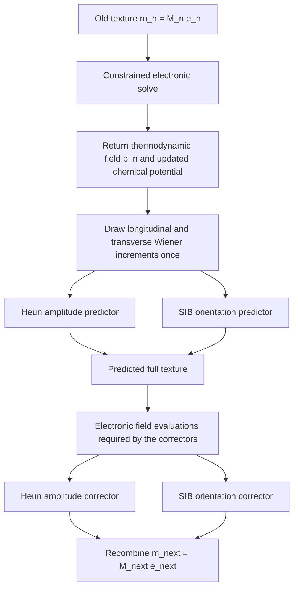

# Longitudinal-Heun / transverse-SIB SDW integrator

This directory explains and verifies the numerical method used for the stochastic spin-density-wave dynamics in Sec. VI and Appendix D of `AVP-dynamics3.pdf`.

The central idea is simple:

- the **length** of the local moment is a soft scalar and must be allowed to grow, shrink, and fluctuate;
- the **direction** is a unit vector and should rotate without numerical length drift.

We therefore integrate these two degrees of freedom differently:

```math
\mathbf m_i=M_i\hat{\mathbf e}_i,
\qquad M_i=|\mathbf m_i|,
\qquad |\hat{\mathbf e}_i|=1.
```

The amplitude `M_i` uses stochastic Heun. The unit orientation `e_i` uses Semi-Implicit Scheme B (SIB).

For a complete derivation from the Hubbard model through the final discrete updates, see [`MANUSCRIPT_CROSSWALK.md`](MANUSCRIPT_CROSSWALK.md).

## 1. What information comes from the electrons?

At a given time, the slow magnetic configuration is the complete set of local moments. A constrained finite-temperature Hartree-Fock calculation forces the electronic spin expectation to reproduce this configuration:

```math
\langle\hat{\mathbf s}_i\rangle=\mathbf m_i.
```

After convergence, the calculation returns the thermodynamic field

```math
\mathbf b_i=-\frac{\partial F}{\partial\mathbf m_i}.
```

This is the field that drives the magnetic dynamics. It must not be confused with the internal one-particle field `h_i` used while solving the constrained Hartree-Fock equations. Appendix D relates them by

```math
\mathbf b_i=\bar{\mathbf h}_i+2U\mathbf m_i.
```

The chemical potential must be recalculated during every constrained solve so that the target filling is maintained.

## 2. The continuous SDW equation

Resolve the field into components parallel and perpendicular to the moment:

```math
\mathbf b_{i,\parallel}
=\hat{\mathbf e}_i(\hat{\mathbf e}_i\cdot\mathbf b_i),
\qquad
\mathbf b_{i,\perp}=\mathbf b_i-\mathbf b_{i,\parallel}.
```

The manuscript's vector equation is

```math
\frac{d\mathbf m_i}{dt}
=\mathbf m_i\times\mathbf b_i
+\Gamma_{\parallel}\mathbf b_{i,\parallel}
+\Gamma_{\perp}\mathbf b_{i,\perp}
+\boldsymbol\eta_i(t).
```

The terms have distinct roles:

| Term | Physical role | Changes amplitude? | Changes direction? |
|---|---|:---:|:---:|
| precession, `m_i × b_i` | reversible rotation | no | yes |
| parallel relaxation | longitudinal relaxation | yes | no |
| perpendicular damping | transverse damping | no | yes |
| thermal noise | fluctuations | both channels | both channels |

Projecting this equation gives the two equations that are actually integrated.

### Amplitude

```math
dM_i
=\Gamma_{\parallel}
(\hat{\mathbf e}_i\cdot\mathbf b_i)\,dt
+\sqrt{2k_BT\Gamma_{\parallel}}\,dW_{i,\parallel}.
```

This is a scalar relaxational equation with additive noise.

### Orientation

```math
d\hat{\mathbf e}_i
=\left[
\hat{\mathbf e}_i\times\mathbf b_i
-\frac{\Gamma_{\perp}}{M_i}
\hat{\mathbf e}_i\times
(\hat{\mathbf e}_i\times\mathbf b_i)
\right]dt
+\frac{\sqrt{2k_BT\Gamma_{\perp}}}{M_i}
P_{i,\perp}\circ d\mathbf W_i.
```

Here

```math
P_{i,\perp}=I-\hat{\mathbf e}_i\hat{\mathbf e}_i^{\mathsf T}.
```

Every orientation increment is tangent to the unit sphere. The circle on the stochastic differential denotes the Stratonovich interpretation.

## 3. Why not use one integrator for everything?

An ordinary explicit update treats the three Cartesian components of `m_i` uniformly. That is convenient, but it does not respect the different geometry of amplitude and orientation.

Stochastic Heun is appropriate for the amplitude because the amplitude is supposed to change. Applying a fixed-length spin method to it would remove the longitudinal physics.

SIB is appropriate for the direction because both its predictor and corrector are implicit-midpoint rotations. Each stage preserves unit length algebraically; no after-step normalization is needed.

## 4. One timestep at a glance



In words:

1. Decompose every old moment into its amplitude and direction.
2. Solve the constrained electronic problem and obtain the thermodynamic field `b_i`.
3. Draw one scalar and one three-component Wiener increment per site.
4. Construct the Heun amplitude predictor.
5. Construct the first SIB orientation rotation.
6. Recompute the electronic fields needed by the Heun endpoint and SIB midpoint evaluations.
7. Finish both correctors using the **same** noise drawn in step 3.
8. Recombine the updated soft moment.

The same-noise requirement is part of the stochastic predictor-corrector method. Drawing new noise in the corrector defines a different algorithm.

## 5. The two discrete updates

For the amplitude, define

```math
f_{M,i}(\mathbf m)
=\Gamma_{\parallel}
\hat{\mathbf e}_i\cdot\mathbf b_i[\mathbf m].
```

The Heun update is

```math
\widetilde M_i=M_{i,n}+h f_{M,i}(\mathbf m_n)
+\sqrt{2k_BT\Gamma_{\parallel}}\,\Delta W_{i,\parallel},
```

```math
M_{i,n+1}=M_{i,n}
+\frac{h}{2}
\left[f_{M,i}(\mathbf m_n)+f_{M,i}(\widetilde{\mathbf m})\right]
+\sqrt{2k_BT\Gamma_{\parallel}}\,\Delta W_{i,\parallel}.
```

For the orientation, rewrite its drift and noise in the SIB cross-product form

```math
d\hat{\mathbf e}_i
=\hat{\mathbf e}_i\times\mathbf a_i\,dt
+\hat{\mathbf e}_i\times\boldsymbol\sigma_i\circ d\mathbf W_i.
```

The predictor and corrector both solve an equation of the form

```math
\mathbf x^+-\mathbf x
=\frac{\mathbf x+\mathbf x^+}{2}\times\mathbf q.
```

The `cayley` routine solves this three-dimensional implicit equation analytically. Taking its dot product with the midpoint proves that the old and new vectors have exactly the same length (up to floating-point roundoff).

## 6. A subtle point: which predicted field is needed?

The manuscript specifies Heun for the amplitude and SIB for the orientation, but it does not enumerate every electronic solve when the field depends on the complete nonuniform texture.

- Heun evaluates its corrected drift at a predicted endpoint.
- SIB evaluates its corrected rotational coefficients at a predicted midpoint.

These configurations coincide in a constant-field test but not generally in the SDW problem. A strict implementation can therefore require separate constrained electronic solves. Reusing a single endpoint field is a computational approximation and should be identified and checked by timestep refinement.

## 7. What has been verified?

The methodology is tested in two progressively broader problems:

- [`check_SIB/`](check_SIB/) verifies the geometric orientation integrator by itself.
- [`check_Heun+SIB/`](check_Heun+SIB/) verifies the reconstructed soft vector `m = M e`.

The observed full-vector orders are:

| Regime | Expected | Observed |
|---|---:|---:|
| deterministic | 2 | 1.998 |
| stochastic strong | 1/2 | 0.521 |
| stochastic weak | 1 | 0.980 |

These results are consistent with the expected limiting orders. They validate the numerical composition, not the constrained electronic solver itself.

## 8. Numerical safeguards that must be explicit

- **Small amplitude:** the orientation is undefined at zero amplitude, and its equation contains the inverse amplitude. Record how often a small-amplitude branch is used.
- **Amplitude sign:** if a scalar step crosses zero, define whether the direction flips and the stored amplitude becomes nonnegative.
- **Upper bound:** the electronic spin amplitude cannot exceed one half. Hard clipping changes an SDE; count clipping events and show they disappear under refinement.
- **Field convergence:** constrained-solver tolerances must be smaller than the change caused by halving the timestep.
- **Filling:** readjust the chemical potential during every diagonalization, including predictor and midpoint solves.

## 9. What remains to validate in the production SDW code?

Run the complete SDW simulation with timesteps `h`, `h/2`, and `h/4` using coupled Brownian paths. Compare

- the full moment texture;
- energy and filling;
- magnetic amplitudes and ordering observables;
- constrained-field residuals;
- small-amplitude and clipping-event rates.

The production timestep is acceptable when these discretization differences are below the statistical uncertainty of the physical observables.

## Reference

J. H. Mentink, M. V. Tretyakov, A. Fasolino, M. I. Katsnelson, and Th. Rasing, “Stable and fast semi-implicit integration of the stochastic Landau-Lifshitz equation,” *Journal of Physics: Condensed Matter* **22**, 176001 (2010), [doi:10.1088/0953-8984/22/17/176001](https://doi.org/10.1088/0953-8984/22/17/176001).
