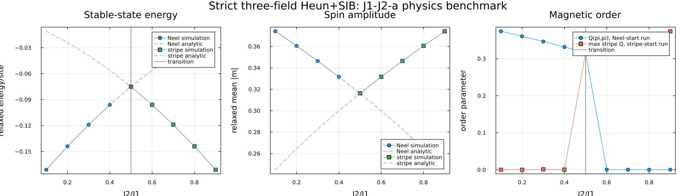
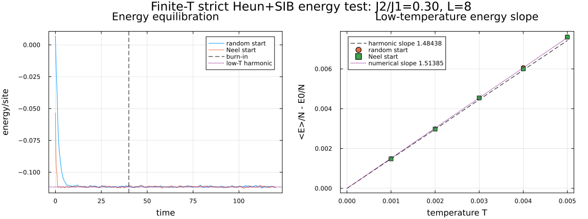

# Strict three-field Heun + SIB: J1-J2-a demonstration

This folder demonstrates the strict three-field integrator for a vector `m = M e` whose spin amplitude `M` can vary. Heun advances the amplitude and SIB advances the unit direction.

In the manuscript, this corresponds to composing the amplitude equation Eq. (62)/Eq. (D11), integrated by Heun, with the orientation equation Eq. (63)/Eq. (D13), integrated by SIB as specified in Appendix D.3.

## 1. Reference algorithm: three field evaluations per timestep

The reference implementation treats amplitude and orientation as two components of one coupled state. Their predictors advance over the same interval, but their correctors require fields at different configurations. For a state-dependent electronic field, one timestep therefore contains **three constrained field evaluations**.

Start from

```math
\mathbf m_n=M_n\mathbf e_n,
\qquad |\mathbf e_n|=1.
```

### 1. Old-state field

Solve the constrained electronic problem at the old texture:

```math
\mathbf b_n=\mathbf b[M_n\mathbf e_n].
```

The chemical potential is readjusted during this and every subsequent electronic solve so that the requested filling is maintained.

### 2. Draw noise once

Draw independent longitudinal and transverse Wiener increments:

```math
\Delta W_\parallel\sim N(0,h),
\qquad
\Delta\mathbf W_\perp\sim N(\mathbf0,hI).
```

The same increments are reused in the predictor and corrector stages. Redrawing noise in a corrector would define a different stochastic method.

### 3. Joint predictor

Define the longitudinal drift

```math
f_M(M,\mathbf e,\mathbf b)
=\Gamma_\parallel\mathbf e\cdot\mathbf b.
```

The Heun amplitude predictor is

```math
\widetilde M
=M_n+h f_M(M_n,\mathbf e_n,\mathbf b_n)
+\sqrt{2k_BT\Gamma_\parallel}\,\Delta W_\parallel.
```

For the orientation, form

```math
\mathbf a_n
=\mathbf b_n
-\frac{\Gamma_\perp}{M_n}
(\mathbf e_n\times\mathbf b_n),
```

include the transverse stochastic rotation in `q_n`, and solve the first SIB equation

```math
\widetilde{\mathbf e}-\mathbf e_n
=\frac{\mathbf e_n+\widetilde{\mathbf e}}{2}
\times\mathbf q_n
```

with the Cayley formula. Consequently,

```math
|\widetilde{\mathbf e}|=1
```

without normalization. The pair `(M_tilde,e_tilde)` is a joint predictor for time `t_(n+1)`.

### 4. Heun corrector at the predicted endpoint

Construct the predicted endpoint texture and perform the second field solve:

```math
\widetilde{\mathbf m}=\widetilde M\widetilde{\mathbf e},
\qquad
\mathbf b_H=\mathbf b[\widetilde{\mathbf m}].
```

Then

```math
M_{n+1}=M_n
+\frac h2\left[
\Gamma_\parallel\mathbf e_n\cdot\mathbf b_n
+\Gamma_\parallel\widetilde{\mathbf e}\cdot\mathbf b_H
\right]
+\sqrt{2k_BT\Gamma_\parallel}\,\Delta W_\parallel.
```

This is ordinary Heun applied to a drift that depends on the complete coupled state, not only on the scalar amplitude.

### 5. SIB corrector at the predicted midpoint

Construct predictor-based midpoint variables:

```math
M_S=\frac{M_n+\widetilde M}{2},
\qquad
\mathbf e_S=\frac{\mathbf e_n+\widetilde{\mathbf e}}{2},
\qquad
\mathbf m_S=M_S\mathbf e_S.
```

The midpoint direction is an evaluation point and is not normalized. Perform the third field solve:

```math
\mathbf b_S=\mathbf b[\mathbf m_S].
```

Evaluate the SIB drift and noise coefficients at `(M_S,e_S,b_S)` and solve

```math
\mathbf e_{n+1}-\mathbf e_n
=\frac{\mathbf e_n+\mathbf e_{n+1}}{2}
\times\mathbf q_S.
```

The Cayley solution gives unit final orientation algebraically. Finally recombine once:

```math
\mathbf m_{n+1}=M_{n+1}\mathbf e_{n+1}.
```

Thus the required fields are

```math
\boxed{\mathbf b_n,\quad\mathbf b_H,\quad\mathbf b_S}.
```

Using `b_H` in the SIB corrector is a cheaper approximation, not the literal midpoint evaluation required by SIB.

## 2. Heun for the spin amplitude

Begin with a scalar Stratonovich stochastic differential equation:

```math
dM=f(M,t)\,dt+g(M,t)\circ dW.
```

For a step of length `h`, draw one Wiener increment

```math
\Delta W_n\sim N(0,h).
```

Heun first forms an Euler predictor:

```math
\widetilde M
=M_n+h f(M_n,t_n)+g(M_n,t_n)\Delta W_n.
```

It then averages the drift and diffusion coefficients at the old and predicted endpoints:

```math
M_{n+1}=M_n
+\frac{h}{2}\left[f(M_n,t_n)+f(\widetilde M,t_{n+1})\right]
+\frac{\Delta W_n}{2}
\left[g(M_n,t_n)+g(\widetilde M,t_{n+1})\right].
```

The same random increment appears in both stages. This predictor-corrector is the stochastic analogue of the explicit trapezoidal rule and is consistent with the Stratonovich interpretation.

## 3. Combining Heun with SIB

One timestep advances two different geometries:

1. Heun advances the spin amplitude.
2. SIB advances the unit orientation through two length-preserving midpoint rotations.
3. The two updated variables are recombined only at the end:

```math
\mathbf m_{i,n+1}=M_{i,n+1}\hat{\mathbf e}_{i,n+1}.
```

The full vector must not be normalized after recombination: doing so would erase the amplitude dynamics. Likewise, SIB should not be applied to the amplitude, because its purpose is precisely to preserve the direction length.

At finite temperature the two methods do not have the same strong convergence order. For this problem, additive-noise Heun gives approximately strong order one, while the SIB orientation with noncommuting multiplicative noise gives strong order one half. The error of the reconstructed vector is therefore expected to be limited by the SIB sector.

## 4. Physical benchmark: variable-amplitude J1-J2-a model

The primary physics demonstration is [`j1j2a_strict_physics.jl`](j1j2a_strict_physics.jl). It uses the strict three-field algorithm on

```math
F=J_1\sum_{\langle ij\rangle}\mathbf m_i\cdot\mathbf m_j
+J_2\sum_{\langle\!\langle ij\rangle\!\rangle}\mathbf m_i\cdot\mathbf m_j
+\frac a4\sum_i(|\mathbf m_i|^2-b)^2.
```

Unlike a fixed-length model, this system tests both pieces of the integrator: SIB rotates each unit direction while Heun changes the local amplitude.

For a uniform-amplitude Néel state,

```math
M_N^2=b+\frac{4(J_1-J_2)}a,
\qquad
\frac{F_N}{N}=(-2J_1+2J_2)M_N^2
+\frac a4(M_N^2-b)^2.
```

For the two-sublattice Néel manifold,

```math
M_2^2=b+\frac{4J_2}a,
\qquad
\frac{F_2}{N}=-2J_2M_2^2
+\frac a4(M_2^2-b)^2.
```

For `J2/J1>1/2`, the two checkerboard sublattices are each Néel ordered by the diagonal `J2` bonds, but their two Néel vectors have an arbitrary relative angle at classical zero temperature. A collinear stripe is only one member of this continuous ground-state manifold; it is not uniquely selected at `T=0`. The two analytic energy formulas cross at `J2/J1=1/2`, where the classical degeneracy is further enhanced.



The numerical relaxation reproduces three linked pieces of physics:

- the crossing between the conventional Néel state and the two-sublattice Néel manifold at `J2/J1=1/2`;
- the analytic relaxed amplitudes on both sides of the transition;
- the change from conventional `Q(pi,pi)` order to independently ordered diagonal sublattices.

### Magnetic order parameters

The conventional Néel quantity is the Fourier magnetic order parameter at `Q=(pi,pi)`. For `N=L^2` sites,

```math
m_{\mathbf Q}
=\frac1N\left|
\sum_{x,y}e^{i(Q_xx+Q_yy)}\mathbf m_{x,y}
\right|.
```

Because the relevant wavevectors contain only `0` and `pi`, the phase factors reduce to signs:

```math
m_{\mathrm N}=m_{(\pi,\pi)}
=\frac1N\left|\sum_{x,y}(-1)^{x+y}\mathbf m_{x,y}\right|,
```

For the large-`J2` manifold, divide the lattice into checkerboard sublattices `A` and `B`, and define

```math
\mathbf n_A=\frac{2}{N}\sum_{(x,y)\in A}(-1)^x\mathbf m_{x,y},
\qquad
\mathbf n_B=\frac{2}{N}\sum_{(x,y)\in B}(-1)^x\mathbf m_{x,y},
```

```math
m_{2\mathrm{sub}}=\frac{|\mathbf n_A|+|\mathbf n_B|}{2}.
```

This detects Néel order separately on the two diagonal-bond sublattices without assuming any relative angle between `n_A` and `n_B`. The zero-temperature simulation deliberately initializes them orthogonally, demonstrating a noncollinear member of the degenerate manifold rather than calling it a stripe state.

All definitions average over the full lattice; no spatial homogeneity is imposed. A collinear stripe diagnostic such as `max(m_(pi,0),m_(0,pi))` becomes appropriate only after the relative angle is selected to be `0` or `pi`. The scalar Ising-nematic/stripe-orientation observable is also distinct. One common plaquette definition is

```math
\phi_p=(\mathbf m_1-\mathbf m_3)\cdot(\mathbf m_2-\mathbf m_4),
```

for cyclically labelled plaquette corners, followed by a lattice average. Equivalently, one may compare horizontal and vertical nearest-neighbor correlations. Thermal order-by-disorder can select the collinear subset and produce finite nematic order. In a strictly two-dimensional isotropic Heisenberg model, this does not imply true finite-temperature vector magnetic long-range order in the thermodynamic limit.

For clarity, the energy and spin-amplitude panels show the conventional Néel initialization for `J2/J1 < 1/2` and the noncollinear two-sublattice initialization for `J2/J1 >= 1/2`. Both analytic formulas are shown over the full range so their crossing remains visible. The order panel shows both preparations over the entire coupling range, including both at `J2/J1 = 1/2`.

Run the full benchmark with

```bash
julia j1j2a_strict_physics.jl
```

or use `--quick` for a short smoke test. The additional scripts in this directory remain available as implementation-level checks, while this README focuses on the physical J1-J2-a demonstration.

## 5. Finite-temperature equilibrium demonstration

[`j1j2a_finite_temperature.jl`](j1j2a_finite_temperature.jl) tests whether the same strict three-field method reaches the expected stationary thermal energy. The longitudinal and transverse increments obey the fluctuation-dissipation amplitudes

```math
dM_i=\Gamma_\parallel\mathbf e_i\cdot\mathbf b_i\,dt
+\sqrt{2k_BT\Gamma_\parallel}\,dW_{i,\parallel},
```

```math
d\mathbf e_i\big|_{\rm noise}
=-\frac{\sqrt{2k_BT\Gamma_\perp}}{M_i}
\mathbf e_i\times\circ d\mathbf W_{i,\perp}.
```

The same Wiener increments are reused in predictor and corrector stages. Heun evaluates the amplitude corrector at the predicted endpoint; SIB evaluates the orientational corrector at the predicted midpoint.

Here `k_B=1`. This test uses `J2/J1=0.30<1/2`, where the low-temperature reference state is the conventional Néel state; it is not a test of finite-temperature stripe selection.

### Equilibration protocol

The test uses `L=8`, `J2/J1=0.30`, `dt=0.002`, and five temperatures,

```math
T=0.001,\ 0.002,\ 0.003,\ 0.004,\ 0.005.
```

At every temperature it runs two statistically independent trajectories:

1. a completely random spin-direction configuration;
2. a noisy Néel configuration.

Both begin with `|m_i|=0.20`, evolve for `60000` steps, and discard the first `20000` steps. No homogeneity constraint is imposed. After burn-in, the energy per site is sampled from the full inhomogeneous configurations. Agreement between independent initial ensembles, stationarity after burn-in, and the temperature dependence of the mean energy are the equilibrium diagnostics. The left panel shows the equilibration history at the largest sampled temperature; the right panel contains all five temperatures.



At every temperature, the random-start and Néel-start energies agree within approximately `1.3` combined standard errors or better. This shows loss of memory of the initial ensemble before testing the analytic temperature dependence.

### Low-temperature analytic comparison

The full interacting finite-temperature model has no closed-form exact energy. For `T` small compared with the exchange and radial stiffness, however, a Gaussian expansion around the Néel saddle gives a controlled analytic benchmark. With

```math
M_0^2=b+\frac{4(J_1-J_2)}a,
\qquad
\frac{E_0}{N}=(-2J_1+2J_2)M_0^2+\frac a4(M_0^2-b)^2,
```

each site has three local real degrees of freedom: one radial amplitude and two angular coordinates. Across `N` sites this gives `3N` harmonic coordinates. The `N` radial modes have nonzero stiffness. Of the `2N` orientational modes, two are uniform rotations of the entire Néel axis. Global spin-rotation symmetry makes these two collective coordinates exact zero modes, so they do not appear as quadratic oscillators and contribute no `k_B T/2` energy. For `J2/J1=0.30`, there are no additional accidental zero modes. The number of nonzero quadratic modes is therefore

```math
N+(2N-2)=3N-2.
```

Classical equipartition assigns `k_B T/2` to each of these modes, predicting

```math
\frac{\langle E\rangle_{\rm harm}}N
=\frac{E_0}{N}+\frac{3N-2}{2N}k_BT+O(T^2).
```

The two zero modes still contribute a finite global orientation volume to the partition function, but they do not raise the energy because rotating every spin together costs exactly zero energy. Therefore the decisive comparison is the slope of the thermal excess energy,

```math
\Delta e(T)=\frac{\langle E(T)\rangle-E_0}{N}.
```

For `L=8`, the analytic harmonic coefficient is

```math
c_{\rm harm}=\frac{3N-2}{2N}=1.484375.
```

A least-squares fit through the known `T=0` intercept to the average of the random-start and Néel-start results gives

```math
c_{\rm numerical}=1.513854.
```

The fitted slope is about `1.99%` above the harmonic value. The numerical points remain nearly linear over `T=0.001` through `0.005`; the small upward difference has the expected sign and scale for anharmonic and `O(T^2)` corrections. Repeating the slope fit at smaller `dt` and over progressively lower temperature windows can distinguish timestep bias from those physical corrections.

This is an equilibration and fluctuation-dissipation demonstration, not by itself a mathematical proof of exact Boltzmann sampling. A stricter production study should additionally repeat the calculation at smaller `dt`, larger `L`, longer burn-in, and several independent seeds.

Run it with

```bash
julia j1j2a_finite_temperature.jl
```

or append `--quick` for a smoke test.

### Initialization protocols used by the two physical benchmarks

- The fixed-length `J1-J2` stability benchmark in `check_SIB` starts from eight fully random unit-spin configurations. Its undamped dynamics conserve energy, so it tests numerical energy stability rather than thermal equilibration.
- The zero-temperature `J1-J2-a` benchmark starts near a conventional Néel state and a noncollinear two-sublattice Néel state. It tests the two analytic energy formulas and their crossing; it does not claim unique stripe order at zero temperature.
- The finite-temperature `J1-J2-a` benchmark starts from both a fully random configuration and a noisy ordered configuration at five temperatures, evolves through a stated burn-in, and compares the measured linear energy slope with the low-temperature harmonic coefficient.

Therefore, “start randomly and evolve for many steps” is part of the finite-temperature protocol, but iteration count alone is not evidence of equilibrium. Observable stationarity, agreement between distinct initial ensembles, autocorrelation-aware uncertainties, and timestep/size refinement are the relevant checks.
