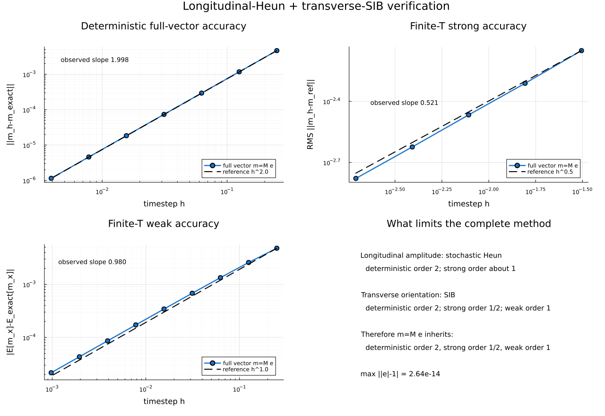
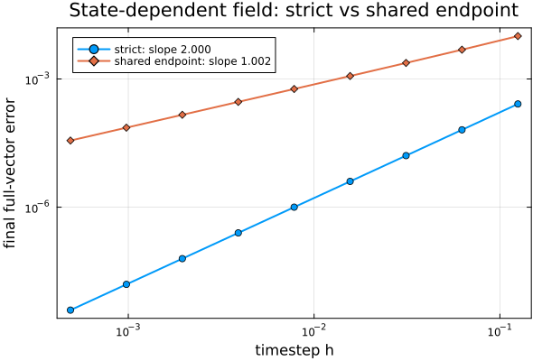

# Combined longitudinal-Heun + transverse-SIB verification

This folder verifies the numerical composition used for a soft vector `m = M e`. It answers a question that the standalone SIB test cannot: when a fluctuating scalar amplitude is recombined with an independently integrated orientation, does the complete vector inherit the expected stochastic accuracy?

In the manuscript, this corresponds to composing the amplitude equation Eq. (62)/Eq. (D11), integrated by Heun, with the orientation equation Eq. (63)/Eq. (D13), integrated by SIB as specified in Appendix D.3.



The plotted quantity is the complete physical vector `m = M e`. The figure makes clear that the transverse SIB sector limits the finite-temperature strong order of the combined method. The plotting source is [`plot_results.jl`](plot_results.jl).

## 1. Stochastic Heun in one dimension

Begin with a scalar Stratonovich stochastic differential equation:

```math
dM=f(M,t)\,dt+g(M,t)\circ dW.
```

For a step of length `h`, draw one Wiener increment

```math
\Delta W_n\sim N(0,h).
```

Heun first forms an Euler predictor:

```math
\widetilde M
=M_n+h f(M_n,t_n)+g(M_n,t_n)\Delta W_n.
```

It then averages the drift and diffusion coefficients at the old and predicted endpoints:

```math
M_{n+1}=M_n
+\frac{h}{2}\left[f(M_n,t_n)+f(\widetilde M,t_{n+1})\right]
+\frac{\Delta W_n}{2}
\left[g(M_n,t_n)+g(\widetilde M,t_{n+1})\right].
```

The same random increment appears in both stages. This predictor-corrector is the stochastic analogue of the explicit trapezoidal rule and is consistent with the Stratonovich interpretation.

## 2. Why the SDW amplitude is simpler

The longitudinal SDW equation has additive noise:

```math
dM_i=f_{M,i}(\mathbf m)\,dt
+\sigma_\parallel\,dW_{i,\parallel},
```

```math
f_{M,i}(\mathbf m)
=\Gamma_\parallel\hat{\mathbf e}_i\cdot\mathbf b_i[\mathbf m],
\qquad
\sigma_\parallel=\sqrt{2k_BT\Gamma_\parallel}.
```

Because the diffusion coefficient is constant, averaging it does not create two noise contributions. The practical update is

```math
\widetilde M_i=M_{i,n}
+h f_{M,i}(\mathbf m_n)
+\sigma_\parallel\Delta W_{i,\parallel},
```

```math
M_{i,n+1}=M_{i,n}
+\frac{h}{2}\left[
f_{M,i}(\mathbf m_n)+f_{M,i}(\widetilde{\mathbf m})
\right]
+\sigma_\parallel\Delta W_{i,\parallel}.
```

The field in the second drift evaluation belongs to the predicted full texture, not merely to a predicted scalar amplitude in isolation.

## 3. Combining Heun with SIB

One timestep advances two different geometries:

1. Heun advances the soft scalar amplitude.
2. SIB advances the unit orientation through two length-preserving midpoint rotations.
3. The two updated variables are recombined only at the end:

```math
\mathbf m_{i,n+1}=M_{i,n+1}\hat{\mathbf e}_{i,n+1}.
```

The full soft vector must not be normalized after recombination: doing so would erase the amplitude dynamics. Likewise, SIB should not be applied to the amplitude, because its purpose is precisely to preserve length.

At finite temperature the two methods do not have the same strong convergence order. For this problem, additive-noise Heun gives approximately strong order one, while the SIB orientation with noncommuting multiplicative noise gives strong order one half. The error of the reconstructed vector is therefore expected to be limited by the SIB sector.

## 4. Manufactured model

The test uses two exactly characterized channels:

```math
dM=-\lambda(M-\bar M)dt+\sigma_M dW_\parallel,
```

```math
d\mathbf e=\mathbf e\times(-\mathbf B)dt-
\sqrt{2D}\,\mathbf e\times\circ d\mathbf W,\qquad |\mathbf e|=1,
```

with `m = M e`. The amplitude is an additive-noise Ornstein-Uhlenbeck process advanced by stochastic Heun. The direction is constant-field precession plus isotropic Stratonovich rotational diffusion advanced by SIB/Cayley. The channels are independent, permitting exact amplitude moments and factorized exact weak moments of the full vector.

## 5. Implementation

`amplitude_heun` performs an Euler predictor followed by a trapezoidal drift correction. The same scalar Brownian increment appears in both stages.

`direction_sib` performs the two implicit-midpoint rotations. In this manufactured problem the field and noise coefficient are state independent, so the two SIB rotation vectors coincide; the two-stage structure remains explicit in the source.

`hybrid_step` advances both channels and reconstructs `m` only after their individual updates. It never applies SIB to the amplitude and never renormalizes the full soft vector.

The original manufactured benchmark deliberately uses independent amplitude and orientation channels, so their execution order is irrelevant. For a state-dependent electronic field, [`coupled_heun_sib_two_fields.jl`](coupled_heun_sib_two_fields.jl) provides the stricter reference implementation. Its `strict_step` performs three field evaluations:

1. old-state field for both predictors;
2. predicted-endpoint field for the Heun corrector;
3. predicted-midpoint field for the SIB corrector.

The file also contains `shared_endpoint_step`, which uses only the endpoint reevaluation for both correctors. It is included solely to expose and quantify that cheaper approximation.

[`compare_strict_vs_shared.jl`](compare_strict_vs_shared.jl) performs the corresponding accuracy test for a nonlinear state-dependent field. It constructs an independent, very fine RK4 solution of the continuous deterministic equations and measures the final full-vector error of both discretizations over a sequence of timesteps. This is stronger evidence than comparing the two discrete trajectories only with each other: it identifies which trajectory is closer to the same continuous equation.



For this benchmark, the strict method has fitted order 2.000, whereas the shared-endpoint approximation has fitted order 1.002. At the finest tested timestep, the shared-field error is approximately 9266 times larger. The midpoint substitution changes the local truncation structure: replacing the SIB midpoint field by an endpoint field introduces an order-`h` coefficient error inside an order-`h` rotation, producing an order-`h²` local defect and therefore an order-`h` global error. This establishes the advantage for the tested nonlinear field; it is not a claim that the strict trajectory has smaller error for every field and every coarse timestep.

The extended finite-temperature comparison is generated by [`compare_strict_vs_shared_full.jl`](compare_strict_vs_shared_full.jl):


- The deterministic full-vector orders remain 2.000 and 1.002.
- The finite-temperature strong slopes are 0.571 for the strict method and 0.922 for the shared approximation over the tested range. The strict slope is approaching the SIB strong-order limit of one half; the shared curve is still dominated by its order-one field-substitution error.
- The shared method has a resolved weak slope of 1.008. The strict weak bias is already smaller than two Monte Carlo standard errors, so fitting and reporting a strict weak slope would be statistically misleading. The CSV retains the unmodified standard errors.

Thus the stochastic comparison should be read primarily through error size and statistical resolution, not as evidence that the strict method has a higher formal stochastic order.

## 6. Demonstrations

### Deterministic test

Both exact solutions are known. Heun is second order for the amplitude and the Cayley/SIB constant-field step is second order for the direction. Therefore the complete vector should be second order.

### Strong finite-temperature test

The coarse and fine simulations use the same Brownian path: coarse Wiener increments are sums of fine-grid increments. The RMS path errors are measured separately for the amplitude, direction, and full vector. The amplitude has strong order about one for additive noise, whereas SIB has strong order one half for the multiplicative orientation noise. Consequently the full vector is limited to strong order one half.

### Weak finite-temperature test

The exact OU mean and variance are compared with the discrete Heun moments. The orientation mean is evaluated through the exact radial expectation of one Cayley step. Because the channels are independent, the mean of the full vector factorizes into the product of the amplitude and orientation means. The expected amplitude-moment order is two, while the orientation and full-vector weak order is one.

### Geometry test

A 100000-step trajectory checks both unit orientation length and the identity `|M e| = |M|`. This catches accidental normalization of the soft vector or drift of the direction norm.

## 7. Reproduction

```bash
julia heun_sib_combined_verification.jl --quick
julia heun_sib_combined_verification.jl
julia plot_results.jl
julia coupled_heun_sib_two_fields.jl
julia compare_strict_vs_shared.jl
julia compare_strict_vs_shared_full.jl
```

## 8. Full-run results

| Quantity | Observed order | Expected order |
|---|---:|---:|
| deterministic amplitude | 2.027967 | 2 |
| deterministic direction | 1.998292 | 2 |
| deterministic full vector | 1.998443 | 2 |
| strong amplitude | 1.011903 | about 1 |
| strong direction | 0.520452 | 0.5 |
| strong full vector | 0.521103 | 0.5 |
| weak amplitude mean | 2.019259 | 2 |
| weak amplitude second moment | 2.018954 | 2 |
| weak direction mean | 0.988901 | 1 |
| weak full-vector mean | 0.979567 | 1 |

The maximum direction-norm error was 2.64 × 10⁻¹⁴, and the maximum error in `|M e| = |M|` was 2.66 × 10⁻¹⁴.

These deviations are small finite-range/statistical effects. The full vector shows the limiting orders predicted by the two component methods: deterministic order two, strong order one-half, and weak order one.

## 9. What this test does not establish

The manufactured field is constant and the amplitude/direction channels are independent. Therefore this test validates the split numerical composition but does not test the state-dependent electronic field, chemical-potential solve, coupling between longitudinal and transverse coefficients, behavior near zero amplitude, or the equilibrium distribution of the production SDW model. Those claims require the actual-code refinement protocol described in the [parent integrator methodology](../).
