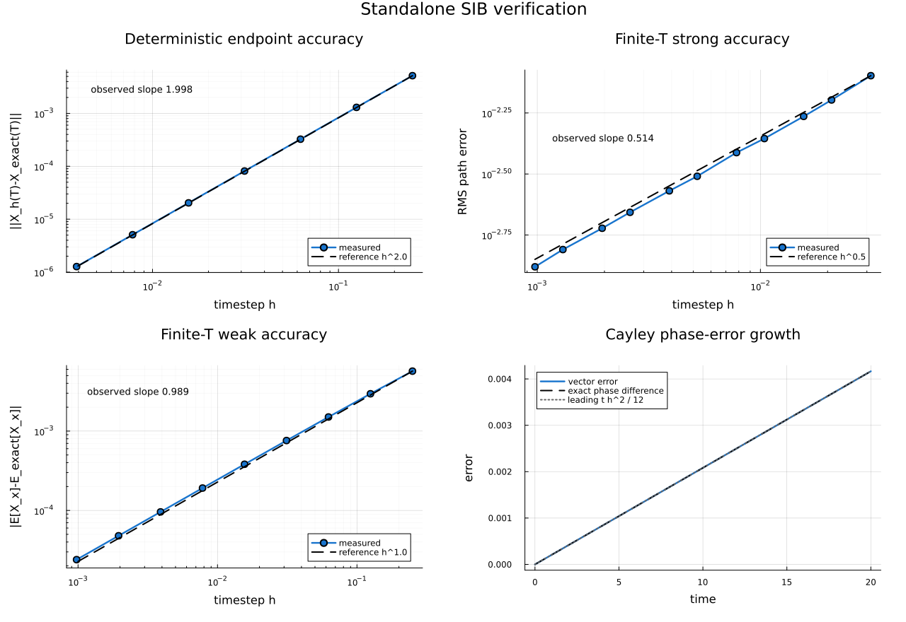

# Standalone SIB verification

This folder isolates the transverse integrator from the SDW electronic calculation. The purpose is to test SIB itself on problems whose geometry, convergence order, or invariants are known independently.

In the manuscript, this is the numerical check of the fixed-length orientation sector in Eq. (63)/Eq. (D13) and the SIB prescription in Appendix D.3. See the [equation-level manuscript crosswalk](../MANUSCRIPT_CROSSWALK.md).



The three log-log panels show the expected deterministic, stochastic strong, and stochastic weak slopes. The final panel checks the analytically predicted Cayley phase-error growth. The plotting source is [`plot_results.jl`](plot_results.jl).

## Code map

`sib_integrator_verification.jl` is the supplied CPU verification program. Its central pieces are:

- `cayley(X,q)`: solves the implicit midpoint rotation analytically. Because the increment is perpendicular to the midpoint, it preserves vector length up to roundoff.
- `drift_a` and `sigma_dW`: write the stochastic Landau-Lifshitz equation in the cross-product form used by SIB.
- `sib_step_constant_field`: executes both SIB iterations. The same Brownian increment is used in predictor and corrector, and each stage is a Cayley rotation.
- `stochastic_convergence`: creates Brownian increments on a fine reference grid. A coarse increment is the exact sum of its fine increments, so coarse and reference solutions follow the same Wiener path.
- `exact_weak_rotational_diffusion`: compares against the analytical first moment shown below. A deterministic radial quadrature evaluates the numerical one-step expectation, avoiding a noisy weak-error fit.

```math
E[X(T)]=e^{-2DT}X(0).
```
- `conservation_tests`: checks a long stochastic trajectory and an undamped two-spin exchange problem.

## What is demonstrated

### Geometry

For the midpoint equation

```math
X^+-X=\frac{X+X^+}{2}\times q,
```

Taking the dot product with the midpoint gives exact length preservation. This is an algebraic property of each SIB stage, not an after-step normalization.

### Deterministic convergence and phase error

A unit spin precessing in a constant unit field has a known exact solution. The Cayley step rotates through the angle shown below, so the accumulated phase error has a known leading term. The endpoint test therefore checks both the expected global order two and the predicted long-time phase-error growth.

```math
\theta_h=2\arctan(h/2),
\qquad
\Delta\phi\simeq t h^2/12.
```

### Stochastic strong convergence

For multiplicative, noncommuting noise, the test measures

```math
\left(E\left[|X_h(T)-X_{\rm ref}(T)|^2\right]\right)^{1/2}.
```

The coupled-path construction is essential: independent coarse and fine noises would measure path variability, not discretization error. SIB is expected to have strong order one half.

### Stochastic weak convergence

The smooth observable is the first spin component. The exact-moment benchmark measures the absolute error in its expectation, for which the expected weak order is one.

### Conservation does not mean exact trajectories

The two-spin test checks total spin and exchange energy in the undamped deterministic limit. Roundoff-level conservation is a structural result; the separate convergence and phase tests show that a norm-preserving trajectory still has finite timestep error.

## Reproduction

```bash
julia sib_integrator_verification.jl --quick
julia sib_integrator_verification.jl
julia plot_results.jl
```

The full run uses 4000 stochastic paths. It writes CSV files, a text summary, and plots when `Plots.jl` is available.

## Full-run results

| Test | Observed | Expected |
|---|---:|---:|
| deterministic global order | 1.998292 | 2 |
| stochastic strong order, global fit | 0.513632 | 0.5 |
| stochastic strong order, five finest points | 0.514390 | 0.5 |
| stochastic weak order, exact moment | 0.988901 | 1 |
| max single-spin norm error, 100000 steps | 1.98 × 10⁻¹⁴ | roundoff |
| max two-spin total-spin error, 100000 steps | 7.69 × 10⁻¹⁴ | roundoff |
| max two-spin exchange-energy error, 100000 steps | 8.03 × 10⁻¹⁴ | roundoff |

The small slope offsets are normal finite-range/statistical deviations: 0.514 is close to 0.5 and 0.989 is close to 1. The appropriate claim is “consistent with the expected orders,” not “exactly equal to the theoretical orders.” The local strong-order estimates fluctuate, while the scaled strong error approaches a plateau; together these are more informative than a single fitted number.

## Scope

This program validates the SIB implementation for fixed-length spins. It does not test the longitudinal soft mode, the SDW field solver, chemical-potential adjustment, or behavior near zero amplitude. Those are addressed separately by the combined manufactured test and the production acceptance protocol.
